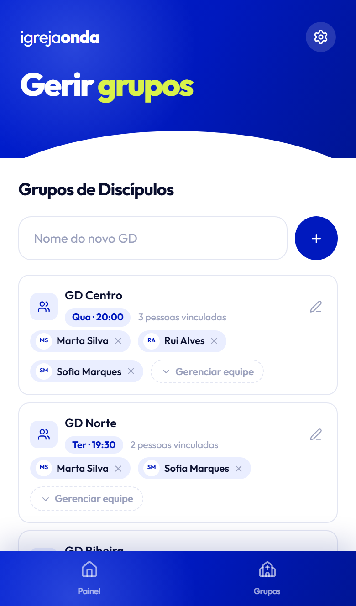

# Gerir grupos

**Só supervisores e pastores.** Chega-se pelo **Menu** (a roda dentada, no canto superior direito) →
**Gerir grupos**, ou pelo separador **Grupos**.

## Criar um GD

Escreve o nome no campo **Nome do novo GD** e toca em **Adicionar**. O nome pode ser mudado depois.

## O dia e a hora

Cada GD tem o **dia da semana** e a **hora** em que se junta. Isto não é decorativo — é o que faz a
app **propor a data certa** quando alguém vai registar presença.

Para definir: toca no lápis **Editar** no cartão do GD.

- **Dia do GD** — toca no dia. Tocar outra vez no mesmo dia **limpa** (fica sem dia definido).
- **Hora** — escolhe a hora.

Toca em **Salvar**.

No cartão do GD, o dia e a hora aparecem como uma etiqueta: **Qua · 20:00**. Sem dia definido,
mostra *Sem dia definido*.

> **Define sempre o dia.** Sem dia, a app não sabe que semanas esperar e não consegue dizer-te se há
> relatórios em falta nesse GD.

## Mudar o nome

**Editar** → muda o nome → **Salvar**. Isto não mexe no dia nem na hora.

## A equipa do GD

Em cada cartão podes ver quem está vinculado e adicionar mais gente em **Gerenciar equipe**.

Vincular alguém é o que dá a essa pessoa acesso ao grupo. Um líder **sem** vínculo não consegue
registar presença — é a causa mais comum de *"não consigo registar"*.

## Arquivar um GD

Se um grupo deixa de existir, arquiva-o em vez de o apagar — o histórico de presenças fica
guardado. No fundo da lista há **Mostrar arquivados** para os veres.

---

**Também podes querer:** [Gerir usuários](gerir-usuarios.md) · [Painel](painel.md)

