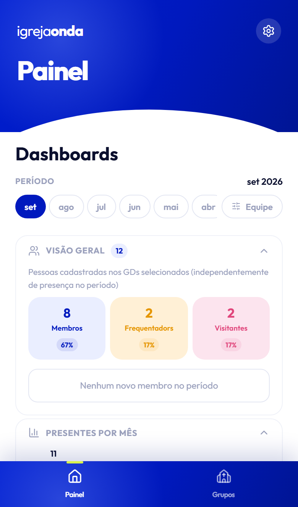

# Painel

O **Painel** é a primeira coisa que vês se fores supervisor ou pastor. É uma vista de conjunto de
todos os GDs a que tens acesso.

## Período

Por cima há uma fila de meses. **Toca num mês** para ver só esse mês, ou toca em dois para ver um
intervalo (por exemplo, de junho a setembro).

Isto afeta as estatísticas — **não** afeta o estado dos relatórios nem a saúde dos GDs, que são
sempre sobre os últimos 30 dias. É de propósito: se estiveres a ver junho, não queres que os avisos
de hoje desapareçam.

## Filtro de equipa

O botão **Equipe** filtra por supervisor ou por GD. Serve para ver o teu grupo de GDs, ou o trabalho
de um supervisor em particular. Aparece com um número quando está a filtrar.

## O que o painel mostra

### Visão geral

Quantas pessoas estão nos GDs selecionados, por categoria, e a percentagem de cada uma. Em baixo, a
faixa **+N novos membros no período** — quem passou a membro desde o início do período escolhido.

### Presentes por mês

Um gráfico de barras dos presentes ao longo dos meses, separado por categoria. Passa o dedo para o
lado se houver mais meses do que cabem.

### Estado dos relatórios

A parte mais útil no dia a dia. Para cada GD:

> **0/5 relatórios nos últimos 30 dias** — e a etiqueta **5 em falta**

Lê-se assim: naquele GD, **houve 5 semanas em que o grupo se juntou e nenhuma delas foi registada**.
Os GDs com mais em falta aparecem primeiro.

As cores:

| Cor | Significa |
| --- | --- |
| 🟢 **Relatórios em dia** | Nada em falta. |
| 🟠 **1 relatório em falta** | Uma semana por registar. |
| 🔴 **2 ou mais em falta** | Vale a pena falar com o líder. |

**Como se conta:** conta-se a partir do dia em que o GD foi criado, e só as semanas em que o grupo
se junta. O próprio dia de hoje nunca conta como falta — se o GD se junta à noite, de manhã ainda
não está atrasado. E se um registo foi feito num dia próximo do habitual, conta como a semana desse
registo, não como semana perdida.

### Saúde do GD

A avaliação mais recente de cada GD, com o comentário. Toca numa linha para ver o texto completo e
o histórico. Ver [Saúde do GD](saude-do-gd.md).

---

**Também podes querer:** [Saúde do GD](saude-do-gd.md) · [Gerir grupos](gerir-gds.md)

